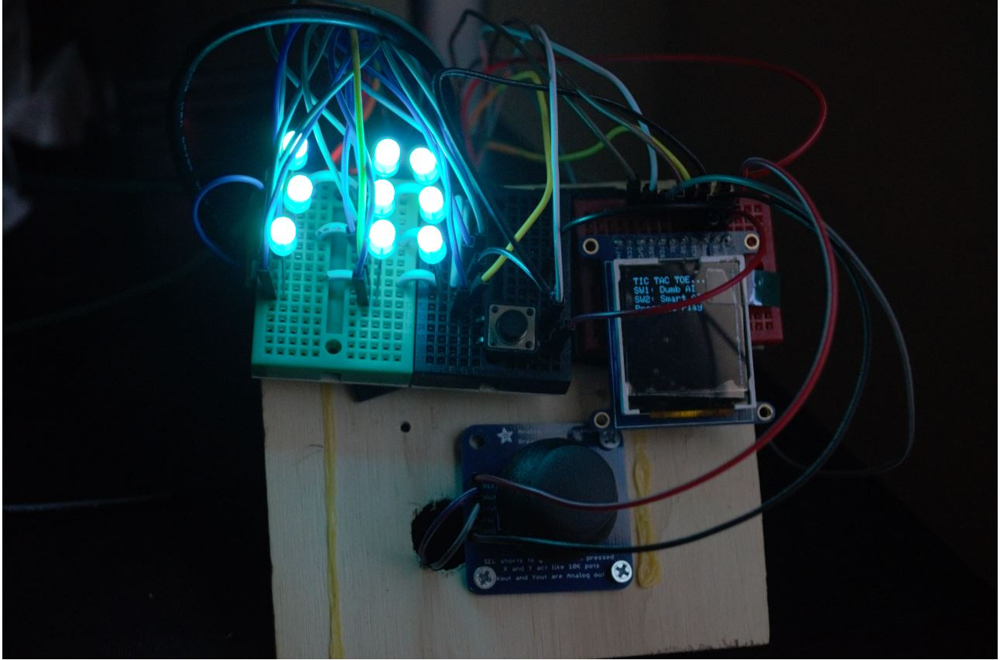
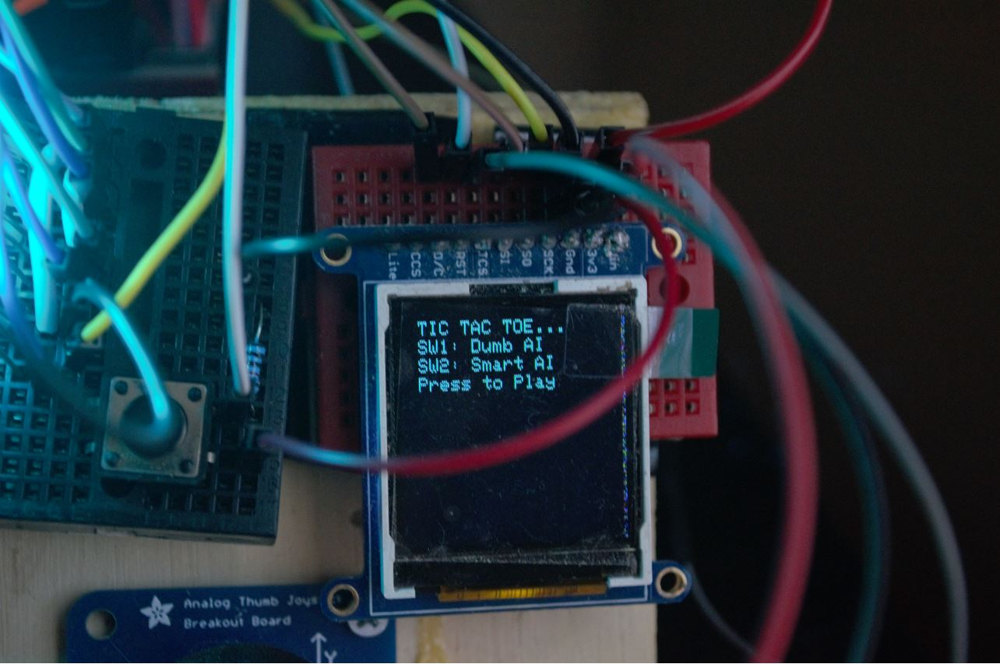
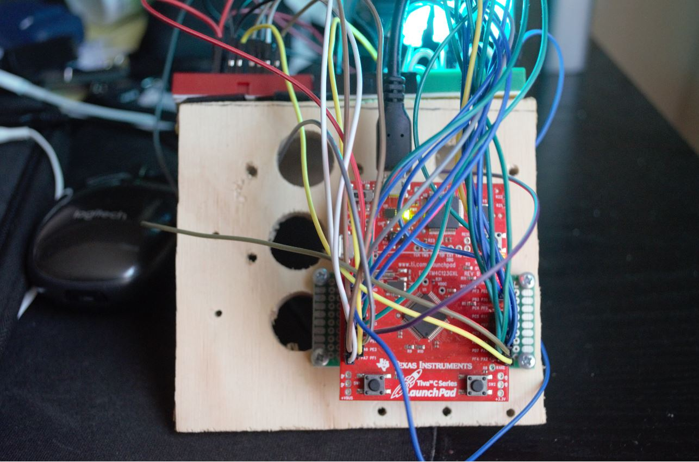
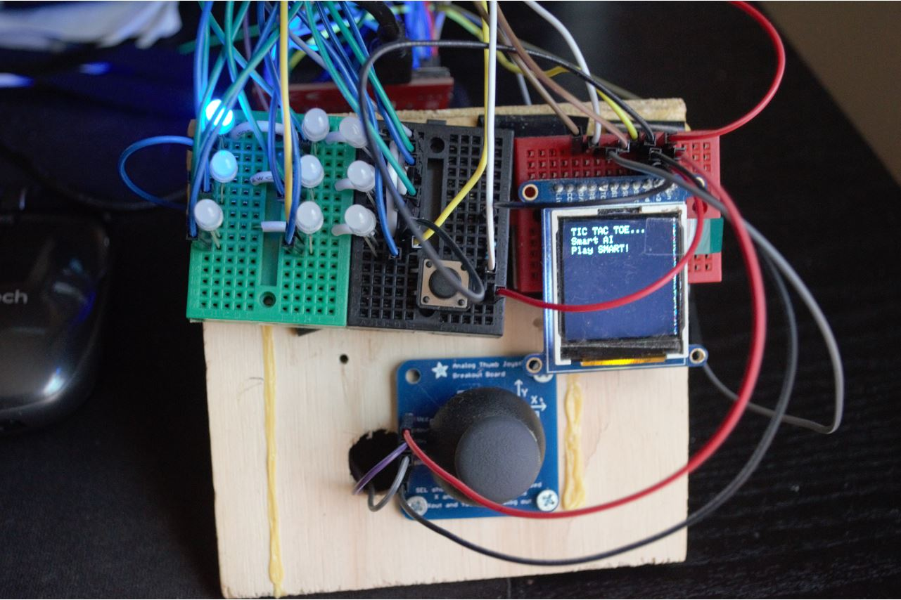
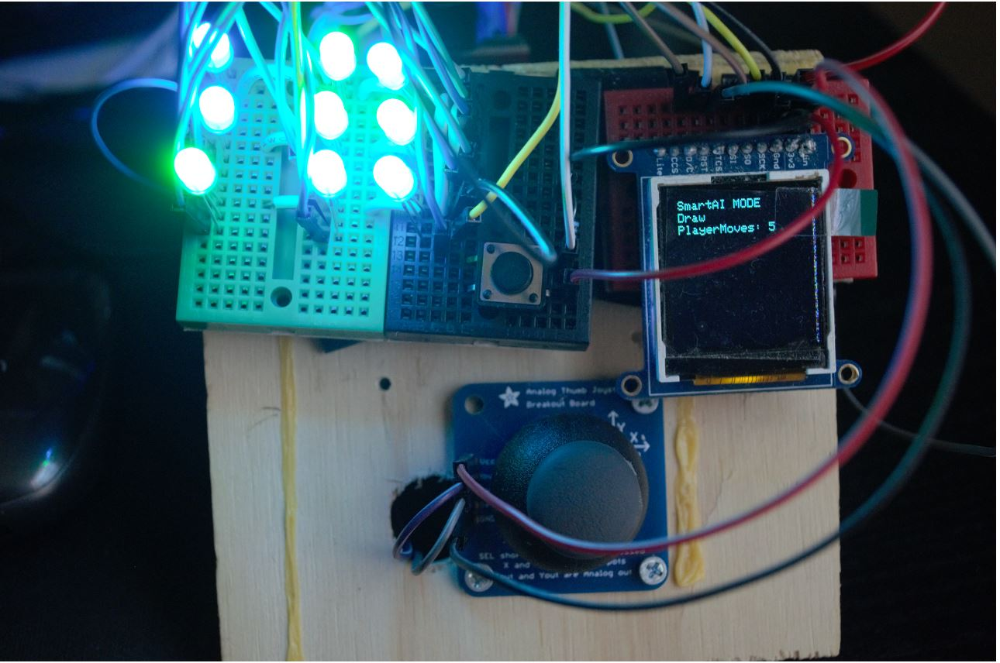
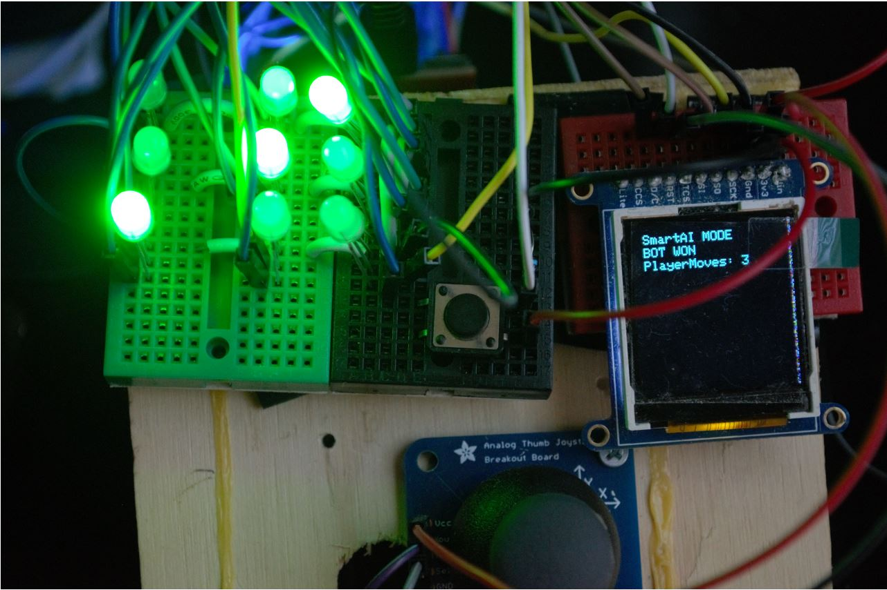
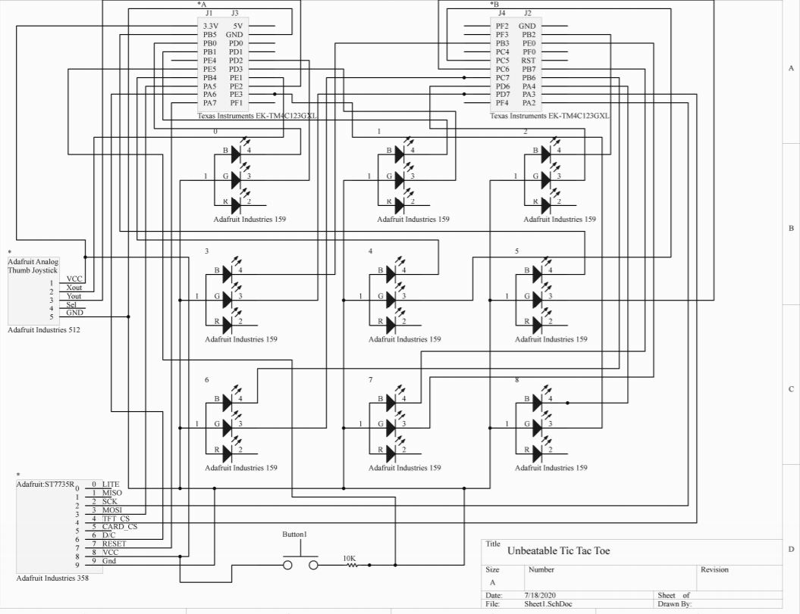

The following is an unbeatable tic-tac-toe game using the tiva TM4C123GXL microcontroller.
# Unbeatable Tic-Tac-Toe

# GameRules
　 1. Player LEDS - Blue
  
   2. Player LEDS - Green
   
# Schematic

